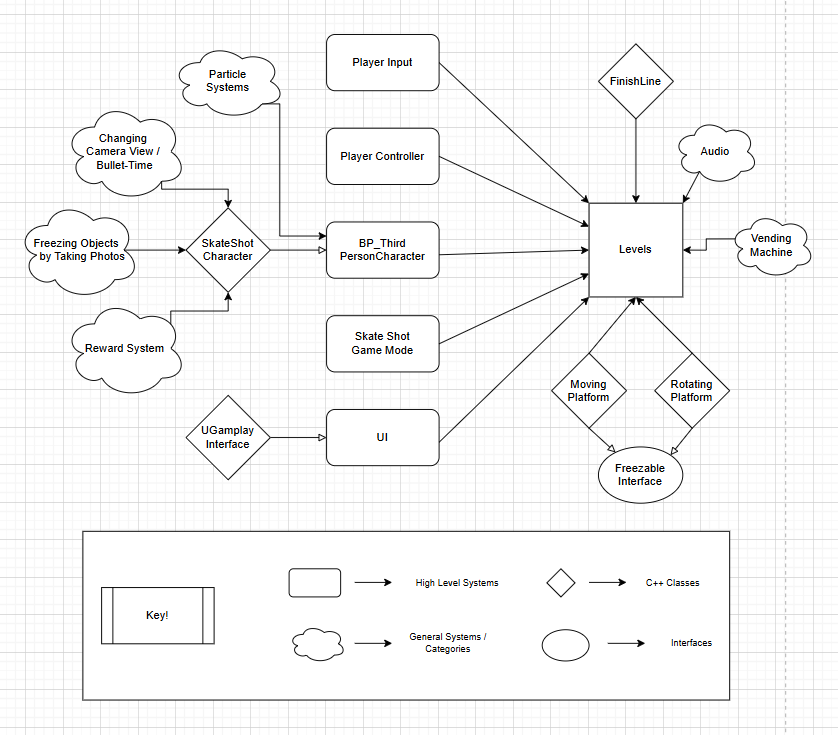

# 📘 Development Portfolio: SkateShot

**Author:** Ben Perry  
**Course:** IMGD 4000  
**Submission Date:** 5/3/25  
**Project Group Name:** RIP Squirrels  

---

## 🧑‍💻 My Role in the Project - Tech & Audio

In this group project, my primary responsibilities were:

- Leader - Leading my group through the development process 
- Documentation - Organizing and describing my work
- Creating UI Systems & Interfaces – Implementing the user interface during gameplay, and providing UI functionality and assets for all of our game menus
- Implementing Camera Mechanics & Systems – Creating the mechanics for freezing objects and transitioning between first and third person views via Blueprints and C++
- Other – The functionality for the vending machine object, the moving and rotating platforms, the reward system, the poison collision, among other things, were created by me
- Audio Producer - I developed all the music for the game, the sound effects are modified freesound.org sound effects (licenses were checked and only completely free assets used)
- Testing - I would test the features other team members added to the project and gave feedback accordingly

Throughout the project lifecycle, I took initiative in assigning tasks to group members to complete and in creating a sense of unity since at first my team had different ideas on what we'd like to do and we were not familiar with each other. I would communicate with everyone and establish meeting times to discuss the gaps in our plans. During the early meetings, I led an exercise where we sought inspiration and ideas towards our game idea for this course, which resulted in Skate Shot. I also led most of the technical development and set out deadlines to keep our working pace consistent despite our busy schedules throughout the term. An example would be when my teammate was struggling with the freezing objects system and managing programming with his other class assignments, so I took up the mantle for that feature, and provided my teammate with a thorough explaination on how I created the system and what its functionality was. 

---

## 🧗 Challenges I Faced

During development, I encountered the following major challenges:

1. **Overstressing Myself**  
   Description: I overloaded myself with courses this academic term, so the weight I held from this course's workload was intense.  
   Why it was a problem: My quality of work would naturally take a dip with more features being worked on simultaneously. Considering I had hefty workloads for my other courses as well, the quality would be acceptable and pretty good for the programming aspect of  the project, but otherwise I wish I could've added more quality with less of a headache.

2. **Blueprint Functionality Occasionally Disappearing Upon Merging**  
   Description: While bugs were usually fixed, some features would occasionally disappear after merging in Github Desktop.
   Why it was a problem: Significant time was usually allocated to complete the features that usually go missing, and the time that we have to waste to put the features back in game, often could have been allocated elsewhere and that was demoralizing. 

   I overcame these challenges by giving myself breaks to just relax, and by ensuring I had a social life to energize me. I would also take a half an hour to deviate to a technical topic I was more interested in when programming started to get stale or discouraging.
---

## 🛠️ Technical Challenges & How I Overcame Them

### Challenge: Accessing the FilmCount variable to update the gameplay interface

- **Solution Approach:**  
  While I wanted to let FilmCount remain a variable solely in Blueprint, 
  I eventually stopped being stubborn and moved the variable and existing functionality
  to increment the variable when colliding with a BP_Film object into C++. This issue 
  helped me work between Blueprint and C++ with more ease and confidence.
  
- **Relevant Code (C++):**
  # In SkateShotCharacter.h
  
  //// Film Count
  UPROPERTY(EditAnywhere, BlueprintReadWrite, Category = "Default")
  int32 FilmCount;

  UFUNCTION(BlueprintCallable, Category = "UI")
  void SetGameplayInterface(UGameplayInterface* InGameplayInterface);

  # In SkateShotCharacter.cpp
  
  void ASkateShotCharacter::TakePhoto() {
    if (isFirstPerson && FilmCount > 0) {
      UGameplayStatics::PlaySound2D(this, TookPictureSFX);
      FilmCount -= 1;
      if (GameplayInterface) {
        GameplayInterface->UpdateFilmCount(FilmCount);
      }

      ...[Remaining Code]
    }
  }

  # In UGameplayInterface.cpp 
  
  void UGameplayInterface::UpdateFilmCount(int32 NewCount)
  {
      if (FilmCountText)
      {
          FilmCountText->SetText(FText::AsNumber(NewCount));
      }
  }

### Challenge: Transferring the reward the player earned by completing the level from the structure storing the data in the Level scene, to the RewardsScreen scene

- **Solution Approach:**  
  Usually the stuff I struggle with in most of my technical projects is data persistance through different scenes.
  I didn't remember how Unreal handles this situation, so I was anxious in implementing this functionality. 
  The approach I settled on after researching was to use a Game Instance to hold the data in general. What I came up with is shown below.
  
- **Relevant Code (C++):**
  # In SkateShotInstance.h

  #pragma once

  #include "CoreMinimal.h"
  #include "Engine/GameInstance.h"
  #include "SkateShotGameInstance.generated.h"

  UCLASS()
  class SKATESHOT_API USkateShotGameInstance : public UGameInstance
  {
      GENERATED_BODY()

  public:
      UPROPERTY(BlueprintReadWrite)
      FString LastReward;
  };

  # In FinishLine.cpp
  
  void AFinishLine::OnPhotoTakenInFinishArea(ASkateShotCharacter* PlayerCharacter) {
    if (bPlayerInFinishArea && !bFinishTriggered) {
        bFinishTriggered = true;
        UGameplayStatics::PlaySound2D(this, WowSFX);
        UE_LOG(LogTemp, Warning, TEXT("Player took photo in finish line area! Level complete."));
        PlayerCharacter->StopTimer();

        URewardSystem* RewardSystem = NewObject<URewardSystem>();
        if (!RewardSystem) {
            UE_LOG(LogTemp, Warning, TEXT("Failed to create reward system"));
            return;
        }

        FString Reward = RewardSystem->CalculateReward(PlayerCharacter->GetFinishingTime());
        GEngine->AddOnScreenDebugMessage(-1, 3.0f, FColor::Yellow, Reward);
    
        if (USkateShotGameInstance* GameInstance = Cast<USkateShotGameInstance>(GetGameInstance())) {
            GameInstance->LastReward = Reward;
        }

        FTimerHandle TimerHandle;
        GetWorld()->GetTimerManager().SetTimer(TimerHandle, [this]() {
            UGameplayStatics::OpenLevel(GetWorld(), NextLevelName);
            }, levelTransitionDelay, false);
    }
  }

### Challenge: Figuring out why the freezing feature worked for the alpha, but no longer worked after a merge afterwards

- **Solution Approach:**  
  Initially, I approached this problem through playtesting myself, extensively. 
  I would alter the properties of the freezable object and when nothing seemed to work
  I switched gears and checked over the C++ code to see if anything was missing.
  Turns out some code was removed during the merge and putting it back solved the issue. This code is show below.
  
- **Relevant Code (C++):**
  # In SkateShotCharacter.cpp
  void ASkateShotCharacter::FreezeVisibleActors(bool bShouldFreeze)
  {
    UWorld* World = GetWorld();
    if (!World) {
      return;
    }

    for (TActorIterator<AActor> It(World); It; ++It)
    {
      AActor* Actor = *It;
      if (Actor->ActorHasTag("Freezable") && Actor->WasRecentlyRendered(0.1f))
      {
        IFreezableInterface* FreezeTarget = Cast<IFreezableInterface>(Actor);
        if (FreezeTarget)
        {
          FreezeTarget->SetFrozen(bShouldFreeze);
        }
      }
    }
  }

## Architectural Diagram

## Lessons Learned:

- **Keep Updating The Timeline / Asset Cart:**
  When doing all the work I had set for myself to do for this smaller project, it was a tad bit daunting. Once I started updating the asset cart regularly through my work, I was more encouraged to continue cruising through the workload since I could see all my accomplishments and the finish line at the same time. It was also hard to tell whether the art team finished certain assets, due to the team's conflicting schedules, until I looked at the asset chart, since they update the chart pretty frequently.

- **Stick with either C++ or Blueprint, doing both makes things harder, especially in the scope of this project:**
  The lesson learned here was to use just Blueprint when constructing my own Unreal projects. Working with Visual Studio was easily the most aggravating aspect of this project. I thought I was mandated to use C++ due to the "technical" emphasis of the course, but I would've rather used solely Blueprint visual scripting to create the project since that eliminates the need for Visual Studio, the need to manage between two forms of programming, and there are simply way more tutorials for Unreal using Blueprint than there are for C++. If I were to use both in tandem
  again, I would allow myself to work at a less tense and more comfortable, albeit professional, pace.

## Version Control:
For this project, my team ended up going with Git and Git LFS. This was namely due to the Perforce server request through WPI giving out errors to our team at the time.
Reflecting back, it's had its ups and downs. I'll detail the pros of the system first. The GUI for Github (Github Desktop in this case) made all the basic functions of source control easy to perform. Not to mention, merge conflicts weren't terribly bad to resolve either, although I recognize that this varies between others. I also already had Git LFS on my laptop, so the rest wasn't terrible to set up within our repository, albeit it still took some time to properly figure out how to implement LFS into the repo, which I guess is a con. The good side of using Git, was characterized mainly through using the GUI. Now for the cons! After merges there was the occasional oddity of missing functionality to our blueprints in some cases, which was irratating to resolve. Also, binary files would frequently fail to merge, but resolving those issues weren't terrible. That's the general concensus I have on my use of version control for this project. Overall, Git LFS is not a bad option, especially after set up is set and done.  